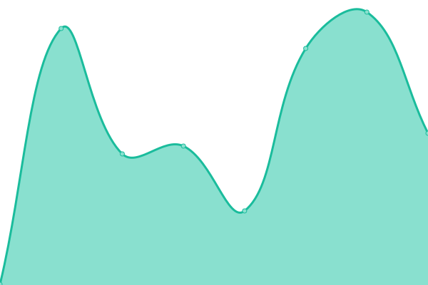

# [📈 Live Status](https://nate2014jatc.github.io/AG-upptime): <!--live status--> **🟩 All systems operational**

This repository contains the open-source uptime monitor and status page for [Nate Bates](astragroup.info), powered by [Upptime](https://github.com/upptime/upptime).

With [Upptime](https://upptime.js.org), you can get your own unlimited and free uptime monitor and status page, powered entirely by a GitHub repository. We use [Issues](https://github.com/nate2014jatc/AG-upptime/issues) as incident reports, [Actions](https://github.com/nate2014jatc/AG-upptime/actions) as uptime monitors, and [Pages](https://nate2014jatc.github.io/AG-upptime) for the status page.

<!--start: status pages-->
<!-- This summary is generated by Upptime (https://github.com/upptime/upptime) -->
<!-- Do not edit this manually, your changes will be overwritten -->
<!-- prettier-ignore -->
| URL | Status | History | Response Time | Uptime |
| --- | ------ | ------- | ------------- | ------ |
|  [Home](https://www.astragroup.info) | 🟩 Up | [home.yml](https://github.com/nate2014jatc/AG-upptime/commits/HEAD/history/home.yml) | 

 2794ms
     
 | 

<a href="https://nate2014jatc.github.io/AG-upptime/history/home">98.75%</a>
    

|  [Status](https://status.astragroup.info) | 🟩 Up | [status.yml](https://github.com/nate2014jatc/AG-upptime/commits/HEAD/history/status.yml) | 

 590ms
     
 | 

<a href="https://nate2014jatc.github.io/AG-upptime/history/status">94.88%</a>
    

|  [Cloud](https://cloud.astragroup.info) | 🟩 Up | [cloud.yml](https://github.com/nate2014jatc/AG-upptime/commits/HEAD/history/cloud.yml) | 

 3151ms
     
 | 

<a href="https://nate2014jatc.github.io/AG-upptime/history/cloud">98.76%</a>
    

|  [Internal Use](https://priv.astragroup.info) | 🟩 Up | [internal-use.yml](https://github.com/nate2014jatc/AG-upptime/commits/HEAD/history/internal-use.yml) | 

 2307ms
     
 | 

<a href="https://nate2014jatc.github.io/AG-upptime/history/internal-use">97.37%</a>
    

<!--end: status pages-->

[**Visit our status website →**](https://nate2014jatc.github.io/AG-upptime)

## 📄 License

- Powered by: [Upptime](https://github.com/upptime/upptime)
- Code: [MIT](./LICENSE) © [Nate Bates](astragroup.info)
- Data in the `./history` directory: [Open Database License](https://opendatacommons.org/licenses/odbl/1-0/)
